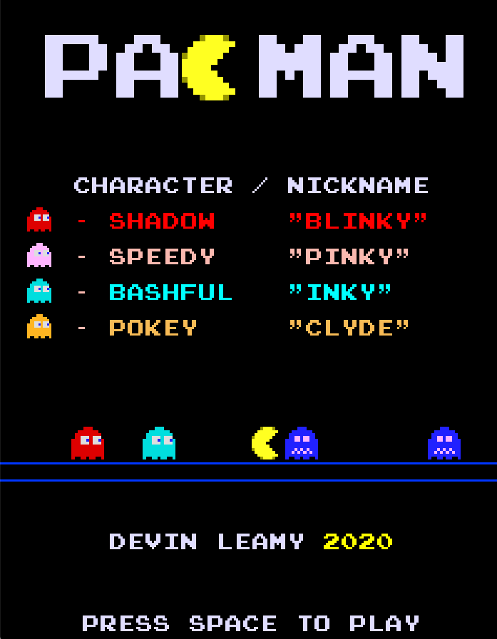
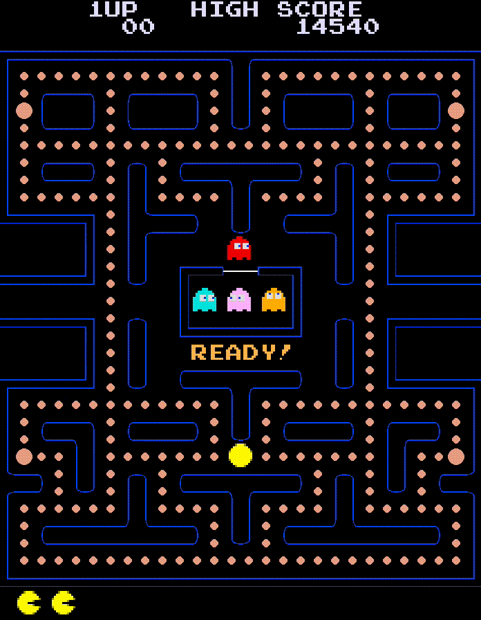

# Retro Games
A couple arcade games I made in python.
# Pacman
The 80s classic Pacman in all its beauty    
<!--  -->

**Deployment:**
 
1. Option One:
    1. Download the Pacman folder
    2. Download Python3 [https://www.python.org/downloads/]
    3. Install pygame(2.0.0) [pip3 and homebrew are easy options]
    4. In terminal, navigate to the file Pacman.py
    5. In terminal type python3 Pacman.py and hit enter
2. Option Two:
    1. Download the Pacman folder
    2. In terminal, navigate to the file Pacman
    3. In terminal type ./Pacman and hit enter
 

Note: To adjust screen size change the variable "square" on line #59 of Pacman/Pacman.py  

**Gameplay (delay is just an artifact of the video quality; it runs smooth):**
 

# Snake
I also wrote 'Snake'...    
**Deployment:**
 
1. Option One:
    1. Download Snake.py
    2. Download Python3 [https://www.python.org/downloads/]
    3. Install pygame [pip3 and homebrew are easy options]
    4. In terminal, navigate to the file Snake.py
    5. In terminal type python3 Snake.py and hit enter
2. Option Two:
    1. Download the Snake folder
    2. Double click on Snake
